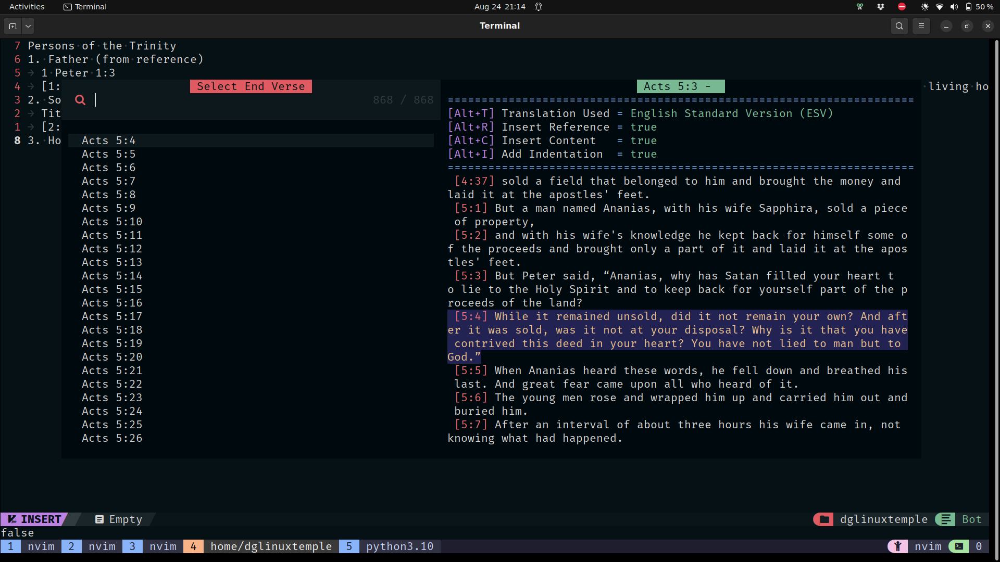

# Bible.nvim - Neovim Plugin

## Purpose - Access Bible from within Neovim



## Setup

**lazy.nvim**

```lua
{
	"MasterTemple/bible.nvim",
	keys = {
		{"<leader>es", '<cmd>lua require("telescope").extensions.bible.bible({isReferenceOnly = false, isMultiSelect = false})<CR>', desc = "Search by verse content" },
		{"<leader>er", '<cmd>lua require("telescope").extensions.bible.bible({isReferenceOnly = true, isMultiSelect = false})<CR>', desc = "Search by verse reference" },
		{"<leader>ems", '<cmd>lua require("telescope").extensions.bible.bible({isReferenceOnly = false, isMultiSelect = true})<CR>', desc = "Search by verse content (multi-select)" },
		{"<leader>emr", '<cmd>lua require("telescope").extensions.bible.bible({isReferenceOnly = true, isMultiSelect = true})<CR>', desc = "Search by verse reference (multi-select)" },
	}
},
```

## Mappings

### Explanation

Note: I initally chose `e` as the first key because it is in ESV.

These can be remapped in the config above.

`s` is to `s`earch through the content

`r` is to get by `r`eference

Prefix the operation with `m` to make it `m`ulti-select (choose a start and end verse)

`Alt+?` set an option but not run anything

`Ctrl+?` runs on current selection

### Open Telescope Menu

`<leader>es`: Search by verse content

`<leader>er`: Search by verse reference

`<leader>ems`: Search by verse content (multi-select)

`<leader>emr`: Search by verse reference (multi-select)

`<leader>et`: Select translation (not implemented yet)

### In Telescope Menu

Hit `Enter` to insert the content and the reference

Hit `Ctrl+W` to insert the whole chapter

Hit `Alt+M` to toggle multi-select [current selection]

Hit `Alt+R` to toggle inserting reference [global: default = true]

Hit `Alt+C` to toggle inserting content [global: default = true]

Hit `Alt+I` to toggle adding indent [global: default = true]

Hit `Alt+S` to toggle showing settings in preview [global: default = true]

## Todo

- Allow user to specify format in setup like: `"{content} [{ref}]"` (options = `book`, `chapter`, `verse`, `ref`, `content`)
- Add proper indentation
- Insert verse content by matching references on current line
- Take what is highlighted as input for Telescope
- Add option to remove unicode apostrophes/quotes
- Add option regarding removing newlines/tabs
- Allow support for more translations (currently only ESV)
